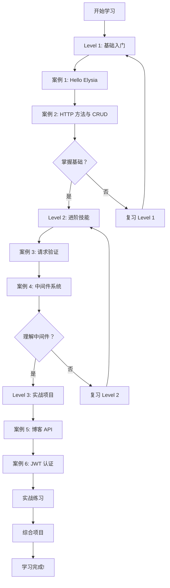

# Elysia 学习项目总览

## 🎯 学习目标

通过本项目的学习，你将能够：

1. ✅ 掌握 Elysia.js 框架的核心概念
2. ✅ 独立开发 RESTful API
3. ✅ 实现用户认证和授权系统
4. ✅ 处理复杂的业务逻辑
5. ✅ 编写类型安全的代码
6. ✅ 部署应用到生产环境

## 📚 学习资源

### 核心文档

| 文档 | 描述 | 适合阶段 |
|------|------|----------|
| [README.md](../README.md) | 项目介绍和快速开始 | 入门 |
| [docs/README.md](README.md) | 详细学习指南 | 入门 - 进阶 |
| [docs/PRACTICE.md](PRACTICE.md) | 实战练习手册 | 进阶 - 实战 |
| [docs/QUICK_REFERENCE.md](QUICK_REFERENCE.md) | 快速参考卡片 | 所有阶段 |

### API 测试

- **Postman Collection**: `docs/elysia-learning.postman_collection.json`
- **在线测试**: 启动服务后访问 `http://localhost:3000-3005`

## 🗺️ 学习路线图

## 📖 案例学习顺序

### 阶段一：基础入门 (1-2 天)

#### Day 1: Hello Elysia
- 📁 文件：`src/basic/01-hello.ts`
- 🎯 目标：理解 Elysia 基础用法
- ⏱️ 预计时间：1 小时
- ✅ 检查点：能独立创建简单路由

**学习步骤**:
1. 阅读代码，理解每个部分的作用
2. 运行服务，测试各个接口
3. 修改代码，添加自定义功能
4. 完成练习手册 Level 1 练习 1.1

#### Day 2: RESTful CRUD
- 📁 文件：`src/basic/02-http-methods.ts`
- 🎯 目标：掌握 RESTful API 设计
- ⏱️ 预计时间：1.5 小时
- ✅ 检查点：能设计完整的 CRUD 接口

**学习步骤**:
1. 理解 RESTful 设计原则
2. 学习 HTTP 方法的语义
3. 掌握状态码的使用
4. 完成练习手册 Level 1 练习 1.2

---

### 阶段二：进阶技能 (2-3 天)

#### Day 3-4: 请求验证
- 📁 文件：`src/intermediate/03-validation.ts`
- 🎯 目标：掌握 TypeBox 验证
- ⏱️ 预计时间：2 小时
- ✅ 检查点：能编写复杂的验证规则

**知识点**:
- TypeBox 基础类型
- 对象验证
- 数组和枚举验证
- 自定义错误处理
- 嵌套验证

#### Day 5-6: 中间件系统
- 📁 文件：`src/intermediate/04-middleware.ts`
- 🎯 目标：理解中间件机制
- ⏱️ 预计时间：2.5 小时
- ✅ 检查点：能编写自定义中间件

**知识点**:
- 全局中间件
- 局部中间件
- 认证中间件
- CORS 配置
- 请求日志

---

### 阶段三：实战项目 (4-6 天)

#### Day 7-9: 博客 API
- 📁 文件：`src/advanced/05-blog-api.ts`
- 🎯 目标：构建完整业务系统
- ⏱️ 预计时间：4 小时
- ✅ 检查点：能处理复杂数据关系

**知识点**:
- 数据模型设计
- 关联查询
- 分页和筛选
- 业务逻辑实现
- 统计接口

#### Day 10-12: JWT 认证
- 📁 文件：`src/advanced/06-auth.ts`
- 🎯 目标：实现安全的认证系统
- ⏱️ 预计时间：4 小时
- ✅ 检查点：能实现完整的认证流程

**知识点**:
- JWT 原理
- Token 生成和验证
- 密码加密
- 刷新 Token
- 权限控制

---

## 🎓 学习检查清单

### Level 1 检查清单

- [ ] 理解 Elysia 的基本结构
- [ ] 能定义不同类型的路由
- [ ] 理解路径参数和查询参数的区别
- [ ] 掌握 HTTP 方法的使用场景
- [ ] 了解常见状态码的含义
- [ ] 能实现基本的 CRUD 操作

### Level 2 检查清单

- [ ] 理解 TypeBox 验证的作用
- [ ] 能编写请求体验证规则
- [ ] 能编写查询参数验证规则
- [ ] 理解中间件的工作原理
- [ ] 能编写自定义中间件
- [ ] 理解 CORS 的概念
- [ ] 能实现基础的认证逻辑

### Level 3 检查清单

- [ ] 能设计合理的数据模型
- [ ] 理解关联查询的实现
- [ ] 掌握分页和筛选技术
- [ ] 能实现复杂的业务逻辑
- [ ] 理解 JWT 认证原理
- [ ] 能实现完整的认证流程
- [ ] 理解权限控制的方法
- [ ] 能处理错误和异常

---

## 💻 实战练习

完成案例学习后，进行实战练习：

### 基础练习
- [ ] 图书馆管理系统
- [ ] 邮箱订阅系统
- [ ] 计算器 API

### 进阶练习
- [ ] API 限流中间件
- [ ] 文件上传服务
- [ ] 电商商品 API

### 高级练习
- [ ] 任务协作平台
- [ ] 在线问卷调查系统
- [ ] 社交网络 API

---

## 📊 学习进度追踪

使用以下表格追踪你的学习进度：

| 日期 | 完成内容 | 用时 | 备注 |
|------|----------|------|------|
| | Level 1 - 案例 1 | | |
| | Level 1 - 案例 2 | | |
| | Level 2 - 案例 3 | | |
| | Level 2 - 案例 4 | | |
| | Level 3 - 案例 5 | | |
| | Level 3 - 案例 6 | | |
| | 实战练习 | | |
| | 综合项目 | | |

---

## 🎯 综合项目建议

学习完成后，尝试完成以下综合项目：

### 项目 1: 电子商务平台

**功能需求**:
- 用户认证 (注册、登录、JWT)
- 商品管理 (CRUD、分类、标签)
- 购物车功能
- 订单系统
- 支付接口集成
- 评论和评分

**技术要点**:
- 复杂数据模型
- 事务处理
- 库存管理
- 权限控制
- 文件上传

### 项目 2: 内容管理系统

**功能需求**:
- 多用户系统 (作者、编辑、管理员)
- 文章管理 (草稿、发布、归档)
- 富文本编辑器集成
- 媒体库管理
- SEO 优化
- 访问统计

**技术要点**:
- 角色权限
- 版本控制
- 全文搜索
- 缓存优化
- CDN 集成

### 项目 3: 任务管理系统

**功能需求**:
- 项目管理
- 任务分配
- 进度跟踪
- 团队协作
- 时间记录
- 报表导出

**技术要点**:
- 实时通知
- 权限细分
- 数据分析
- 导出功能
- Webhooks

---

## 🚀 下一步

完成本教程后，你可以：

1. **深入学习**
   - 研究 Elysia 源码
   - 学习高级设计模式
   - 探索性能优化

2. **扩展技能**
   - 数据库集成 (PostgreSQL, MongoDB)
   - 消息队列 (Redis, RabbitMQ)
   - 微服务架构
   - GraphQL

3. **部署运维**
   - Docker 容器化
   - Kubernetes 编排
   - CI/CD 流程
   - 监控和日志

4. **参与社区**
   - 贡献开源代码
   - 分享学习经验
   - 帮助其他学习者

---

## 📬 获取帮助

- 📖 官方文档：https://elysiajs.com
- 💬 Discord 社区：https://discord.gg/elysia
- 🐛 问题反馈：GitHub Issues
- 📧 联系作者：查看项目仓库

---

祝你学习顺利！🎉
